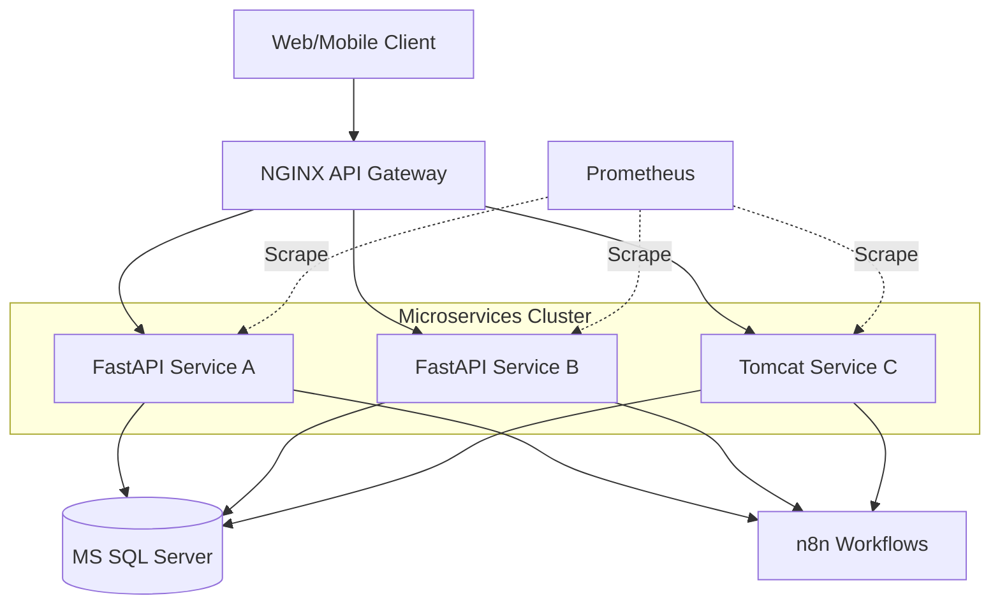

# Enterprise Architecture Guide: Podman on macOS (M1/ARM64)

## Part 1: Monolithic Architecture Design

In this approach, the core business logic resides within a single unit of deployment. For this environment, we containerize the backend components (Python FastAPI and Apache Tomcat) into a unified functional block.

### Architecture Diagram
    graph TD
    Client[Web/Mobile Client] --> Nginx[NGINX Reverse Proxy]
    subgraph MonolithPod [Monolithic App Unit]
        App[Python FastAPI + Tomcat WARs]
        Scraper[Python Flask Scraper + Config API]
        ConfigUI[React Config UI]
    end
    Nginx --> App
    Nginx --> Scraper
    Nginx --> ConfigUI
    App --> MSSQL[(MS SQL Server)]
    App --> n8n[n8n Workflows]
    Scraper --> n8n
    Prometheus[Prometheus] -.->|Scrape| App
    Prometheus -.->|Scrape| MSSQL
    Prometheus -.->|Scrape| n8n
```

### Characteristics
- **Unified Deployment**: Python and Tomcat are managed together.
- **Simplified Networking**: Internal communication between backend services is local.
- **Shared Resources**: Optimized for environments with limited memory overhead.

### Advantages & Disadvantages
| Ventajas | Desventajas |
| :--- | :--- |
| Simplicidad de despliegue y monitoreo | Difícil de escalar componentes individuales |
| Menor latencia de red interna | Acoplamiento fuerte entre tecnologías |
| Debugging simplificado (Single entry point) | Riesgo de fallos en cascada |

---

## Part 2: Microservices Architecture Design

This architecture decouples every functional component into its own independent container, enabling granular scaling and lifecycle management.

### Architecture Diagram


### Communication & Service Discovery
- **REST Communication**: Services communicate via HTTP/REST APIs.
- **Service Discovery**: Podman's internal DNS allows discovery by container name (e.g., `http://tomcat:8080`).
- **External Configuration**: All connections strings are injected via environment variables.

---

## Part 3: Infrastructure (Networking & Persistence)

### Networking
- **Network Name**: `enterprise-net`
- **DNS**: Enabled by default in Podman for container-to-container communication.

### Persistence
- `mssql_data`: SQL Server Database files.
- `prometheus_data`: Metrics and time-series data.
- `grafana_data`: Dashboard configurations and user data.
- `n8n_data`: Workflow definitions.

---

## Part 4: Kubernetes Migration Strategy

### Mapping Podman to Kubernetes
| Podman Concept | Kubernetes Object | Rationale |
| :--- | :--- | :--- |
| Container | Pod / Deployment | Unit of execution and scaling. |
| Network | Service (ClusterIP) | Internal routing and load balancing. |
| Volume | PersistentVolumeClaim (PVC) | Decoupled storage lifecycle. |
| Env Vars | ConfigMap / Secret | Externalized configuration. |

---

## Part 5: Implementation Guide (setup-env.sh)

El script de automatización implementa un despliegue **idempotente**, lo que significa que puedes ejecutarlo múltiples veces y siempre obtendrás el mismo estado corregido.

### Características del Script:
- **Función `deploy_container`**: Detiene y elimina contenedores existentes antes de recrearlos.
- **Ajustes para macOS M1**: Utiliza `--privileged` y `--pid=host` para que los agentes de monitoreo tengan acceso total al kernel de la VM Linux de Podman.
- **Capa de Gateway**: Nginx actúa como punto de entrada único, redirigiendo el tráfico a las aplicaciones correspondientes.

---

## Part 6: Observability & Alerting (Enterprise Level)

### 1. Prometheus (Métricas)
Se han integrado exportadores avanzados para visibilidad total:
- **Node Exporter**: Métricas de hardware del sistema host.
- **cAdvisor**: Métricas granulares por cada contenedor (CPU/Memoria individual).
- **Reglas de Alerta**: Definidas para detectar caídas de servicios y picos de consumo.

### 2. Grafana Premium Dashboard
- **Diseño**: "Enterprise Executive Observability".
- **Filtrado Dinámico**: Permite filtrar gráficas por nombre de Pod (`pod="tomcat"`, `pod="mssql"`, etc).
- **Semáforo de Salud**: Tabla visual con el estado de los servicios en tiempo real.

### 3. Prueba de Aplicación (WAR)
- Se incluye un `hello.war` desplegado en la ruta `/hello/`.
- **Acceso**: `http://localhost/hello/`

---

## Part 7: Technology Selection Matrix

| Tecnología | Rol Recomendado | Cuándo elegirlo |
| :--- | :--- | :--- |
| **FastAPI** | Microservicios Backend | Necesitas velocidad extrema y escalabilidad granular. |
| **Django** | Monolito o App Base | Necesitas auth, admin y ORM listos rápidamente. |
| **React** | Administrative Frontend | UI moderna para configuración y gestión (Config UI). |
| **Tomcat** | Legacy / Java | Aplicaciones corporativas Java (.war). |

> [!IMPORTANT]
> Esta arquitectura está lista para ser migrada a un Helm Chart de Kubernetes con cambios mínimos en los archivos de configuración y Dockerfiles.
